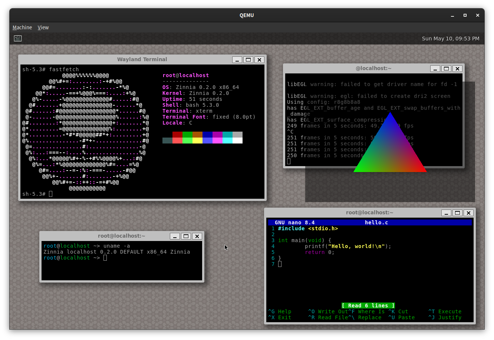

# Zinnia


Zinnia is a modular 64-bit Unix-like kernel written in Rust.



The kernel implements most POSIX interfaces, and some BSD/Linux extensions like
epoll and timerfd. It also implements DRM and evdev drivers for rendering and input.

> [!NOTE]
> This repository contains only the kernel and drivers.
> If you want to get a bootable image, you might want to check out
> **https://github.com/zinnia-os/bootstrap** instead.

# Building

## Cloning the repository

```sh
git clone https://github.com/zinnia-os/zinnia
git submodule update --init --recursive
```

## Compiling the kernel

To compile the kernel you will need:
- cargo
- rustc
- clang (Used for bindgen)
- lld

Make sure you have a full nightly toolchain installed,
including the `rust-src` component.

The following commmand will build the kernel and all drivers for x86_64:
```sh
cargo +nightly build --release -Zjson-target-spec --target toolchain/x86_64-kernel.json
```

## Debugging

Follow the debugging setup from **https://github.com/zinnia-os/bootstrap**
